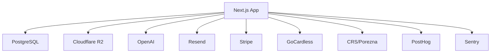

# Services Inventory

Last updated: 2025-12-15

## Summary

FiskAI consists of the following internal and external services.

## Internal Services

### Next.js Application Server

- **Framework**: Next.js 14+ with App Router
- **Runtime**: Node.js
- **Port**: 3000 (dev), 3002 (configurable via APP_PORT)
- **Evidence**: `package.json`, `.env.example:5`

### Database (Prisma + PostgreSQL)

- **ORM**: Prisma Client
- **Database**: PostgreSQL
- **Adapter**: `@prisma/adapter-pg` with connection pooling
- **Evidence**: `src/lib/db.ts:1-15`, `prisma/schema.prisma:1-7`

### Authentication (NextAuth.js)

- **Strategy**: JWT-based sessions
- **Adapter**: PrismaAdapter
- **Providers**: Credentials, Google OAuth, WebAuthn
- **Evidence**: `src/lib/auth.ts:1-150`

### Background Job Processor

- **Platform**: Vercel Cron
- **Jobs**: bank-sync, email-sync, fiscal-processor
- **Evidence**: `vercel.json:1-12`

## External Services

### AI/ML Services

| Service             | Purpose                   | Evidence                                      |
| ------------------- | ------------------------- | --------------------------------------------- |
| OpenAI GPT-4 Vision | Receipt OCR extraction    | `src/lib/ai/ocr.ts:7-11`                      |
| OpenAI Embeddings   | Document search (planned) | `docs/design/architecture.md:59`              |
| DeepSeek            | Alternative AI provider   | `src/lib/ai/deepseek.ts:20`                   |
| Ollama              | Self-hosted vision model  | `src/app/api/import/process/route.ts:179-181` |

### Email Services

| Service         | Purpose              | Evidence                                        |
| --------------- | -------------------- | ----------------------------------------------- |
| Resend          | Transactional email  | `src/lib/email.ts:4`                            |
| Gmail API       | Email import         | `src/lib/email-sync/providers/gmail.ts:11-12`   |
| Microsoft Graph | Outlook email import | `src/lib/email-sync/providers/microsoft.ts:3-4` |

### Storage Services

| Service       | Purpose                  | Evidence                    |
| ------------- | ------------------------ | --------------------------- |
| Cloudflare R2 | Document/receipt storage | `src/lib/r2-client.ts:7-14` |

### Payment Services

| Service | Purpose              | Evidence                       |
| ------- | -------------------- | ------------------------------ |
| Stripe  | Subscription billing | `src/lib/billing/stripe.ts:13` |

### Banking Services

| Service    | Purpose          | Evidence                                          |
| ---------- | ---------------- | ------------------------------------------------- |
| GoCardless | Open Banking API | `src/lib/bank-sync/providers/gocardless.ts:13-24` |

### Croatian Government Services

| Service              | Purpose             | Evidence                                          |
| -------------------- | ------------------- | ------------------------------------------------- |
| CRS (Porezna Uprava) | Tax fiscalization   | `docs/02_FEATURES/features/fiscal-certificate.md` |
| Sudski Registar      | Business OIB lookup | `src/lib/oib-lookup.ts:34-35`                     |
| ie-racuni.hr         | E-invoice provider  | `src/lib/e-invoice/providers/ie-racuni.ts:29-31`  |

### Analytics & Monitoring

| Service | Purpose            | Evidence                   |
| ------- | ------------------ | -------------------------- |
| PostHog | Product analytics  | `src/lib/analytics.ts:3-4` |
| Sentry  | Error tracking     | `.env.example:68-73`       |
| Pino    | Structured logging | `src/lib/logger.ts:5-12`   |

## Service Dependencies

## Health Check Endpoints

| Endpoint            | Purpose         | Evidence                            |
| ------------------- | --------------- | ----------------------------------- |
| `/api/health`       | Liveness check  | `src/app/api/health/route.ts`       |
| `/api/health/ready` | Readiness check | `src/app/api/health/ready/route.ts` |
| `/api/status`       | System status   | `src/app/api/status/route.ts`       |
